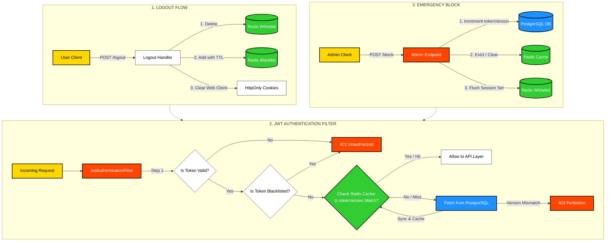

# 🚀 Multi-Module SpringBoot System
[](#)
[](#)

[](#)
[](#)
[](#)
[](#)


A robust, multi-module Spring Boot ecosystem designed for secure user authentication, profile management, and event-driven notifications.

---

## 🏗️ 0. System Architecture

The project is built on a **Modular Monolith/Microservices-ready** architecture, ensuring high decoupling and scalability.

*   **User Service:** The core business logic engine.
*   **Notify Service:** Asynchronous worker for external communications.
*   **Common:** Shared domain objects and utilities.
*   **Event-Driven:** Uses **Apache Kafka** with the **Transactional Outbox Pattern** to ensure data consistency between the database and message broker.
*   **Database Migrations:** Uses **Flyway** for reliable, automated, and version-controlled database schema management during application startup.

### Architecture Diagram


---

## 📦 1. Modules Breakdown

### 🔹 `user-service` (Primary Service)
The heart of the system, handling all user-related state changes.
*   **Authentication:** Secure Login, Logout, and Registration.
*   **Token Management:** Hybrid support for **HttpOnly Cookies** (Web) and **JWT Bearer Tokens** (Mobile).
*   **Authorization:** Role-Based Access Control (RBAC) with `ROLE_USER` and `ROLE_ADMIN`.
*   **Admin Domain:** Manage users (Delete, Block/Unblock, Role assignment).
*   **Persistence:** PostgreSQL with custom Global Exception Handling.

### 🔹 `notify-service` (Event Consumer)
An isolated service that reacts to system events.
*   **Kafka Integration:** Listens for events emitted by `user-service`.
*   **Features:** Triggers verification emails, password reset links, and security alerts based on event types.

### 🔹 `common` (Shared Library)
*   Centralized repository for DTOs, Constants, and Shared Models to ensure type safety across services.

---

## 🛠️ 2. Tech Stack


| Category | Technology |
| :--- | :--- |
| **Language** | Java 21 (LTS) |
| **Framework** | Spring Boot 3.1.x |
| **Security** | Spring Security & JWT |
| **Database** | PostgreSQL |
| **Database Migration** | Flyway |
| **Caching** | Redis (Token Revocation & Rate Limiting) |
| **Messaging** | Apache Kafka |
| **Build Tool** | Maven |

---

## 🚀 Quick Start (Local Development)

Follow these steps to get the project up and running on your local machine.

### 📋 Prerequisites
To minimize setup friction, you only need to have the following installed:
*   **JDK 21** (or higher)
*   **Docker & Docker Compose**
*   **IntelliJ IDEA** (Recommended IDE)
*   *Note: You do **NOT** need to install Maven globally. The project uses the bundled Maven Wrapper.*

---

### Step 1: Clone the Repository
Open your terminal or command prompt and run:
```bash
git clone https://github.com
cd your-repo-name
```

---

### Step 2: Launch Development Infrastructure (Docker)
Before running the Java applications, you must start the core infrastructure (PostgreSQL, Redis, Kafka, etc.). 

Navigate to the directory where your Docker files are located and start the containers using the specific dev file:
```bash
docker compose -f docker-compose-infra-dev.yaml up -d
```
*(To stop the infrastructure containers later, run `docker compose -f docker-compose-infra-dev.yaml down`)*

---

### Step 3: Build the Project
Once the infrastructure is running, you need to compile the parent project and link all internal module dependencies together. Run this command from the project **root** directory:

```bash
# On Windows (PowerShell):
.\mvnw clean install -DskipTests

# On Mac / Linux:
./mvnw clean install -DskipTests
```

---

### Step 4: Run the Application Services

Now you can start your microservices. Choose either **Option A** (via the IDE UI) or **Option B** (via Terminal).

#### Option A: Running via IntelliJ IDEA (Recommended & Easiest)
1. Open IntelliJ IDEA, click **Open**, and select the root `pom.xml` to import the project.
2. Ensure the project is using **JDK 21** (*File -> Project Structure -> Project*). IntelliJ will automatically detect and use the bundled Maven Wrapper.
3. Wait for the IDE to finish indexing and downloading dependencies.
4. Locate the main application class for the service you want to start (e.g., `UserServiceApplication.java` inside `user-service`).
5. Click the green **Run** (Play) button next to the `main` method.
6. *To apply the `dev` profile:* Go to *Run -> Edit Configurations*, select your application, and add `-Dspring-boot.run.profiles=dev` into the **VM options**.

#### Option B: Running via Terminal (Using Maven Wrapper)
If you prefer the command line, run the following commands from the project **root** directory (quotes are required to prevent Windows PowerShell syntax errors):

```bash
# Start User Service (Port 8081)
.\mvnw spring-boot:run -pl user-service "-Dspring-boot.run.profiles=dev"

# Start Notify Service
.\mvnw spring-boot:run -pl notify-service "-Dspring-boot.run.profiles=dev"
```
*(If you are on Mac or Linux, simply replace `.\mvnw` with `./mvnw`)*

## ⚙️ 4. Environment Variables & Local Configuration

For local development, the application requires the **`dev`** profile to be active. Custom environment variables (such as third-party API keys, webhook secrets, or external API URLs) are managed via a local `.env` file located in the project root directory.

Thanks to Spring Boot's native configuration import feature, **no IDE plugins or terminal hacks are required** to load these variables. Spring is pre-configured to automatically import them at startup:

```yaml
spring:
  config:
    import: "file:../../.env[.properties]"
```

### Step 1: Create your local `.env` file
The repository contains a template with placeholder values. You need to copy it to enable your local overrides:

1. Locate the **`.env.example.dev`** file in the project **root** directory.
2. Duplicate it in the same directory and rename the copy to exactly **`.env`**.
3. Open the newly created **`.env`** file and fill in your actual private data (e.g., your custom API keys, external service URLs, or local secrets).

> ⚠️ **Important:** The `.env` file contains sensitive information and is automatically excluded by Git. Never commit your real `.env` file to the repository.

---

## 📖 5. API Documentation & Testing

The system is fully documented using **OpenAPI 3 (Swagger)**.

*   **Interactive UI:** `http://localhost:8081/swagger-ui/index.html`
*   **JSON Definition:** `http://localhost:8081/v3/api-docs` (Import this link into **Postman** for a ready-to-use collection).

---
## 🔒 3. Session Lifecycle & Token Revocation Architecture

The system utilizes a multi-layered security verification strategy combining low-latency in-memory checks via Redis with absolute source-of-truth validation via PostgreSQL. This approach mitigates database bottleneck constraints during high-throughput API routing.

To achieve a stateless yet fully revocable authentication system, the architecture splits security responsibilities into three distinct mechanisms:

1. **Access Token Blacklist (Redis):** When a user logs out, their valid *Access Token* is added to a Redis Blacklist with a Time-To-Live (TTL) matching its remaining expiration time. The system rejects any request using a blacklisted token until it naturally expires.
2. **Refresh Token Whitelist (Redis):** *Refresh Tokens* are strictly tracked via a Redis Whitelist (stored as a Set per user). During logout or session invalidation, the token is permanently deleted from this set, immediately preventing the client from requesting new Access Tokens.
3. **Token Versioning (Redis Cache + PostgreSQL):** Every user profile contains a `tokenVersion` counter. 
   * When an *Access Token* is issued, the current version is embedded into its claims.
   * On every API request, the security filter extracts this version and compares it against the active `tokenVersion` stored in a fast-path **Redis Cache**.
   * If there is a **Cache Miss**, the system falls back to **PostgreSQL** to pull the absolute source of truth and repopulates the cache.
   * If an administrator triggers an emergency block, the `tokenVersion` is incremented in the DB, and the Redis cache is cleared. Instantly, all existing Access Tokens become invalid due to a version mismatch, enforcing a global session kill without performance degradation.
4. **Brute-Force & Rate Limiting Protection (Redis + Lua Scripting):** To defend against credential stuffing and brute-force attacks, the login pipeline evaluates request velocity *before* touching the database or verifying passwords.
   * **Atomic Verification:** The system executes an atomic **Lua script (`login_attempts.lua`)** directly inside Redis to check and increment the login attempts counter for the specific username.
   * **Sliding Window:** Upon the first failed or new attempt, a custom sliding window TTL is set. If the attempts counter crosses the `MAX_LOGIN_ATTEMPTS` threshold, the script deletes the counter, flags the user as locked (`lockeduserKey`), and sets a lockout lock time dynamically (e.g., 60 seconds).
   * **Early Fail-Fast:** If Redis returns `-1` (user is locked), the `user-service` short-circuits the pipeline immediately, throwing a `QApplicationException` mapped to a HTTP `429 Too Many Requests` state, safeguarding database resource pools from malicious stress.


