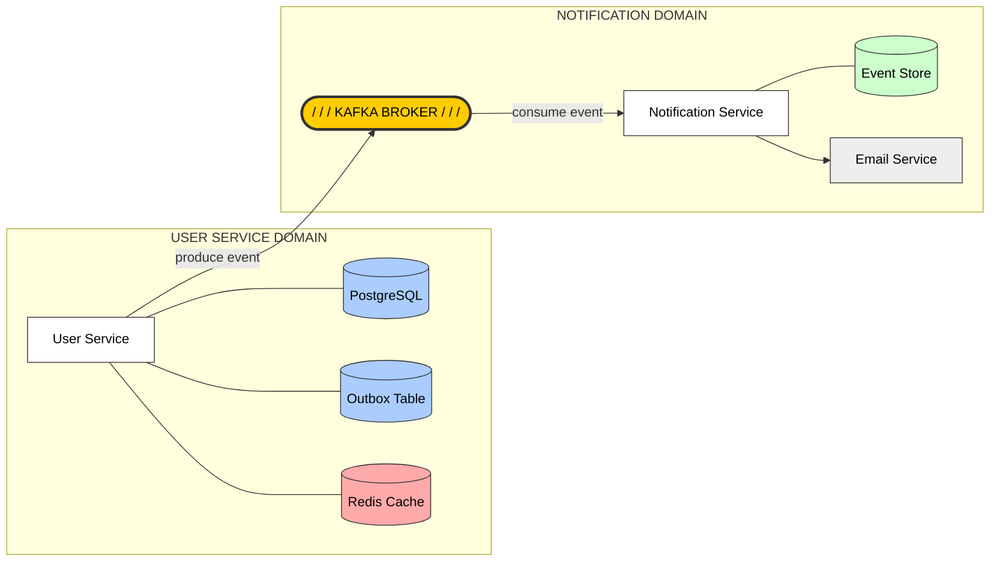

# 🚀 Multi-Service User Management System
[](#)
[](#)

[](#)
[](#)
[](#)
[](#)


A robust, multi-module Spring Boot ecosystem designed for secure user authentication, profile management, and event-driven notifications.

---

## 🏗️ 0. System Architecture

The project is built on a **Modular Monolith/Microservices-ready** architecture, ensuring high decoupling and scalability.

*   **User Service:** The core business logic engine.
*   **Notify Service:** Asynchronous worker for external communications.
*   **Common:** Shared domain objects and utilities.
*   **Event-Driven:** Uses **Apache Kafka** with the **Transactional Outbox Pattern** to ensure data consistency between the database and message broker.
*   **Database Migrations:** Uses **Flyway** for reliable, automated, and version-controlled database schema management during application startup.

### Architecture Diagram


---

## 📦 1. Modules Breakdown

### 🔹 `user-service` (Primary Service)
The heart of the system, handling all user-related state changes.
*   **Authentication:** Secure Login, Logout, and Registration.
*   **Token Management:** Hybrid support for **HttpOnly Cookies** (Web) and **JWT Bearer Tokens** (Mobile).
*   **Authorization:** Role-Based Access Control (RBAC) with `ROLE_USER` and `ROLE_ADMIN`.
*   **Admin Domain:** Manage users (Delete, Block/Unblock, Role assignment).
*   **Persistence:** PostgreSQL with custom Global Exception Handling.

### 🔹 `notify-service` (Event Consumer)
An isolated service that reacts to system events.
*   **Kafka Integration:** Listens for events emitted by `user-service`.
*   **Features:** Triggers verification emails, password reset links, and security alerts based on event types.

### 🔹 `common` (Shared Library)
*   Centralized repository for DTOs, Constants, and Shared Models to ensure type safety across services.

---

## 🛠️ 2. Tech Stack


| Category | Technology |
| :--- | :--- |
| **Language** | Java 21 (LTS) |
| **Framework** | Spring Boot 3.1.x |
| **Security** | Spring Security & JWT |
| **Database** | PostgreSQL |
| **Database Migration** | Flyway |
| **Caching** | Redis (Token Revocation & Rate Limiting) |
| **Messaging** | Apache Kafka |
| **Build Tool** | Maven |

---

## 🚀 3. Quick Start

### Prerequisites
*   **Docker & Docker Compose**
*   **JDK 21**
*   **Maven 3.9+**

### Step 1: Clone the repository
```bash
git clone https://github.com
cd user-service
```

### Step 2: Launch Infrastructure
Start PostgreSQL, Redis, and Kafka using the provided docker-compose file:
```bash
docker-compose up -d
```

### Step 3: Build and Run
```bash
# Build all modules
mvn clean install

# Start User Service (Port 8081)
mvn spring-boot:run -pl user-service

# Start Notify Service
mvn spring-boot:run -pl notify-service
```

---

## ⚙️ 4. Environment Variables


| Variable | Description | Default Value |
| :--- | :--- | :--- |
| `SERVER_PORT` | Port for the service | `8081` |
| `SPRING_DATASOURCE_URL` | PostgreSQL URL | `jdbc:postgresql://localhost:5432/user_db` |
| `SPRING_DATA_REDIS_HOST` | Redis Host | `localhost` |
| `SPRING_KAFKA_BOOTSTRAP_SERVERS` | Kafka Broker | `localhost:9092` |

---

## 📖 5. API Documentation & Testing

The system is fully documented using **OpenAPI 3 (Swagger)**.

*   **Interactive UI:** `http://localhost:8081/swagger-ui/index.html`
*   **JSON Definition:** `http://localhost:8081/v3/api-docs` (Import this link into **Postman** for a ready-to-use collection).

---

## 📝 6. Example Requests

### **Login (Mobile Client)**
**POST** `/api/v1/auth/login`  
*Header:* `X-Client-Type: mobile`
```json
{
    "username": "richard",
    "password": "secure_password"
}
```

### **Update Profile**
**PATCH** `/api/v1/profile/update`  
*Header:* `Authorization: Bearer <access_token>`
```json
{
    "firstName": "Richard",
    "bio": "Software Engineer"
}
```
