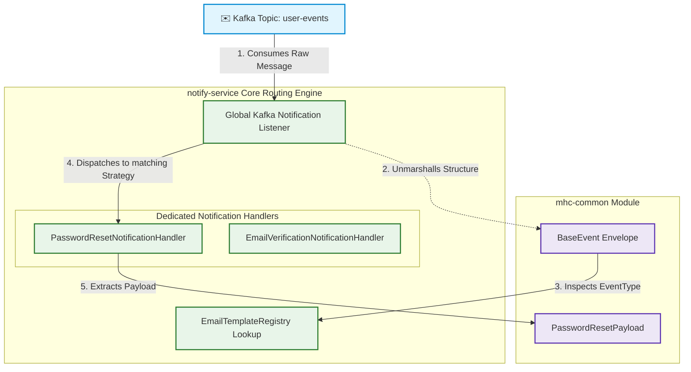
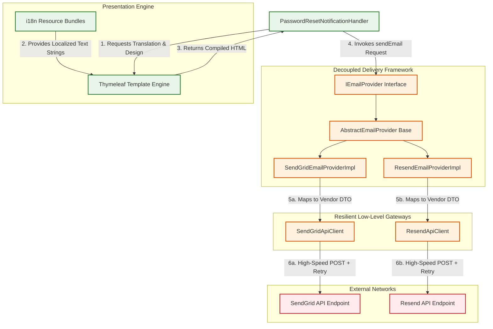

# 📬 Notify Service Module

The `notify-service` is an asynchronous, event-driven notification component designed to ingest domain events across our ecosystem and process them into localized transactional notifications. 

The architecture strictly decoupled event ingestion from message delivery, allowing the service to scale seamlessly and adapt to multi-channel distribution in the future.

---

## 🏛️ Shared Domain Events (`mhc-common`)

To avoid schema duplication and guarantee type safety across the distributed system, all microservices share a contract layer housed in the **`mhc-common`** module. 

Every message sent through our Apache Kafka cluster is wrapped in a generic envelope (`BaseEvent<T>`), allowing `notify-service` to reliably read metadata before unpacking the specific payload.

### The Unified Event Envelope
```java
@Builder
@Jacksonized
public record BaseEvent<T>(
        UUID eventId,
        EventType eventType,
        int eventVersion,
        Instant createdAt,
        String userId,
        EventMetadata metadata,
        String destinationTopic,
        T payload
) {}
```

* **Producer (`user-service`)**: Dispatches a typed instance, such as `BaseEvent<PasswordResetPayload>`, directly into Kafka when a user triggers an action.
* **Consumer (`notify-service`)**: Consumes the generic envelope, inspects the `eventType`, and triggers the appropriate execution stream.

---

## ⚡ 1. Inbound Ingestion & Strategy Routing Architecture

The first architectural boundary handles message ingestion, payload extraction, and dynamic routing using the **Strategy Pattern**. A central listener absorbs the generic event and safely delegates execution to a single-purpose domain handler.



### The Strategy Routing Flow
1. **Event Consumption**: The `Global Kafka Notification Listener` fetches the incoming JSON block from the designated Kafka topic.
2. **Envelope Unpacking**: Utilizing the contracts inside `mhc-common`, the listener extracts the metadata envelope.
3. **Registry Resolution**: The `EmailTemplateRegistry` checks the inner `EventType` (e.g., `PASSWORD_RESET_REQUEST`) to identify the required delivery properties.
4. **Strategy Delegation**: Instead of executing a massive conditional `switch-case`, Spring dynamically matches the target event to its dedicated single-responsibility class implementation (such as `PasswordResetNotificationHandler`).

---

## 🛠️ 2. Template Compilation & Provider Abstraction Layer

Once a handler accepts an event, it shifts responsibility to the rendering and delivery subsystem. The pipeline remains completely hidden from low-level HTTP client implementation details by utilizing an encapsulated abstract boundary hierarchy.



### Problem Solved: Multiple Providers & Independent Delivery
* **The Template Engine**: Dedicated handlers mix structural HTML templates (`password-reset.html`) and external translation properties safely using the server-side Thymeleaf framework, outputting an uncoupled pure text layout string.
* **The Interface Layer (`IEmailProvider`)**: Handlers view nothing but a clean business-facing API contract containing a single decoupled method declaration: `void sendEmail(EmailRequest request)`.
* **The Base Structure (`AbstractEmailProvider`)**: This abstract base class sits between the interface contract and physical clients to provide standardized fallback logic, logging hooks, and baseline cross-cutting operational checks.
* **Provider Implementations**: Custom implementations like `SendGridEmailProviderImpl` and `ResendEmailProviderImpl` extend the abstract engine base. They are tasked exclusively with mapping our standard payload data into specific, specialized cloud vendor DTOs.
* **Resilient Infrastructure Gateways**: Independent gateway beans (`SendGridApiClient`, `ResendApiClient`) wrap around native Spring `RestClient` blocks. Advanced performance controls such as **Spring Retry** are attached directly inside these gateways, insulating the broader software application from third-party network hiccups, server failures, or 429 API rate limitations.
