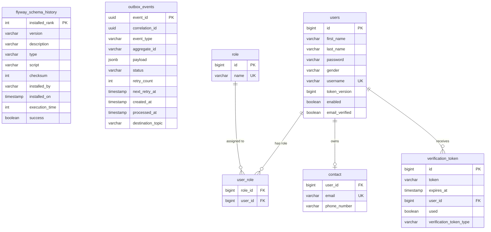

## User-Service DB Schema

```mermaid
erDiagram
    %% Independent / System Tables
    flyway_schema_history {
        int installed_rank PK
        varchar version
        varchar description
        varchar type
        varchar script
        int checksum
        varchar installed_by
        timestamp installed_on
        int execution_time
        boolean success
    }

    outbox_events {
        uuid event_id PK
        uuid correlation_id
        varchar event_type
        varchar aggregate_id
        jsonb payload
        varchar status
        int retry_count
        timestamp next_retry_at
        timestamp created_at
        timestamp processed_at
        varchar destination_topic
    }

    %% Main Entities and Relationships
    users ||--o{ user_role : "has role"
    role ||--o{ user_role : "assigned to"
    users ||--o| contact : "owns"
    users ||--o{ verification_token : "receives"

    users {
        bigint id PK
        varchar first_name
        varchar last_name
        varchar password
        varchar gender
        varchar username UK
        bigint token_version
        boolean enabled
        boolean email_verified
    }

    role {
        bigint id PK
        varchar name UK
    }

    user_role {
        bigint role_id FK
        bigint user_id FK
    }

    contact {
        bigint user_id FK
        varchar email UK
        varchar phone_number
    }

    verification_token {
        bigint id PK
        varchar token
        timestamp expires_at
        bigint user_id FK
        boolean used
        varchar verification_token_type
    }
```
